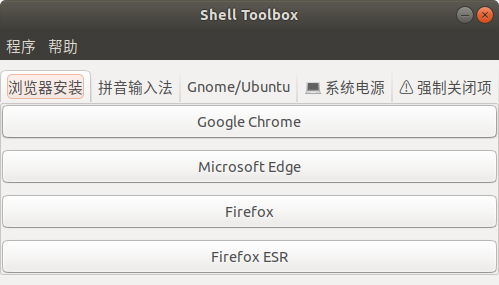

# Shell Toolbox

-----

一个便于执行 Shell 脚本的工具箱🗄️



## 安装方法

请从 [Github Release](https://github.com/CatIsNotFound/ShellToolbox/releases) 页面下载即可.

### Debian 包
在当前下载目录下打开终端，并执行如下命令:

```shell
sudo dpkg -i ./ShellToolbox*.deb
shell-toolbox 
```

若无法打开，请执行: `shell-toolbox --reset` 以重新生成配置文件
若出现无法打开且无法执行脚本的情况, 请尝试执行: `shell-toolbox --repair`.

### Zip 包
在当前下载目录下打开终端，并执行如下命令:

```shell
unzip ShellToolbox*.zip
cd ShellToolbox
./shell-toolbox  
```

若无法打开软件, 请执行: `./shell-toolbox --reset` 以重新生成配置文件.

若出现无法打开且无法执行脚本的情况, 请尝试执行: `./shell-toolbox --repair`.

## 参阅信息

关于执行脚本，请仔细参阅 [Github Wiki](https://github.com/CatIsNotFound/ShellToolbox/wiki) 页面以查看细节.
